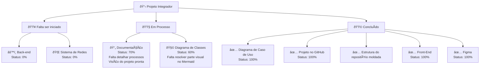

```mermaid
graph TD
    A[📋 Projeto Integrador] --> B[🟥 Falta ser iniciado]
    A --> C[🟧 Em Processo]
    A --> D[🟩 Concluído]

    %% Falta iniciar
    B --> B1[âš™ï¸ Back-end\nStatus: 0%]
    B --> B2[🌠Sistema de Redes\nStatus: 0%]

    %% Em processo
    C --> C3[📄 Documentação\nStatus: 70%\nFalta detalhar processos\nVisão do projeto pronta]
    C --> C4[🧩 Diagrama de Classes\nStatus: 60%\nFalta resolver parte visual no Mermaid]

    %% Concluído
    D --> D1[✅ Diagrama de Caso de Uso\nStatus: 100%]
    D --> D2[✅ Projeto no GitHub\nStatus: 100%]
    D --> D3[✅ Estrutura do repositório moldada]
    D --> C1[✅ Front-End\nStatus: 100%]
    D --> C2[✅ Figma\nStatus: 100%]
```
