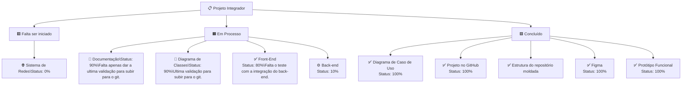

```mermaid
graph TD
    A[📋 Projeto Integrador] --> B[🟥 Falta ser iniciado]
    A --> C[🟧 Em Processo]
    A --> D[🟩 Concluído]

    %% Falta iniciar
    B --> B2[🌐 Sistema de Redes\Status: 0%]

    %% Em processo
    
    C --> C1[📄 Documentação\Status: 90%\Falta apenas dar a ultima validação para subir para o git.]
    C --> C2[🧩 Diagrama de Classes\Status: 90%\Ultima validação para subir para o git.]
    C --> C3[✅ Front-End\nStatus: 80%\Falta o teste com a integração do back-end.]
    C --> C4[⚙️ Back-end\nStatus: 10%]

    %% Concluído
    D --> D1[✅ Diagrama de Caso de Uso\nStatus: 100%]
    D --> D2[✅ Projeto no GitHub\nStatus: 100%]
    D --> D3[✅ Estrutura do repositório moldada]
    D --> D4[✅ Figma\nStatus: 100%]
    D --> D5[✅ Protótipo Funcional\nStatus: 100%]
```
